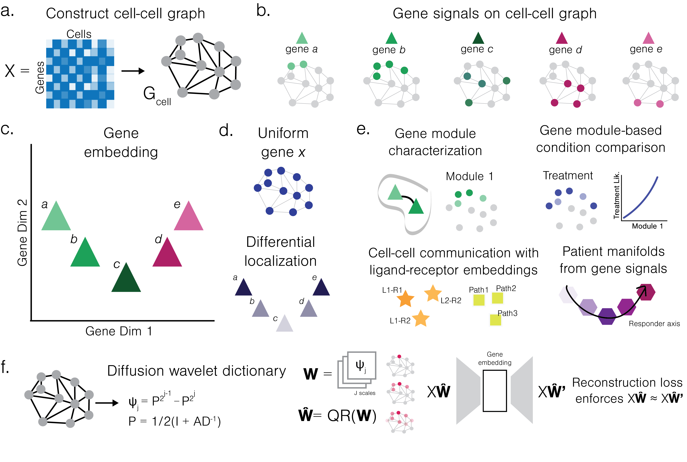

## Mapping the gene space at single-cell resolution with Gene Signal Pattern Analysis

Considering genes as signals on a cell-cell graph allows us to map their expression patterns. This enables complex analyses, including gene cluster analysis, differential topology analysis, and patient characterization by gene-gene graphs.

